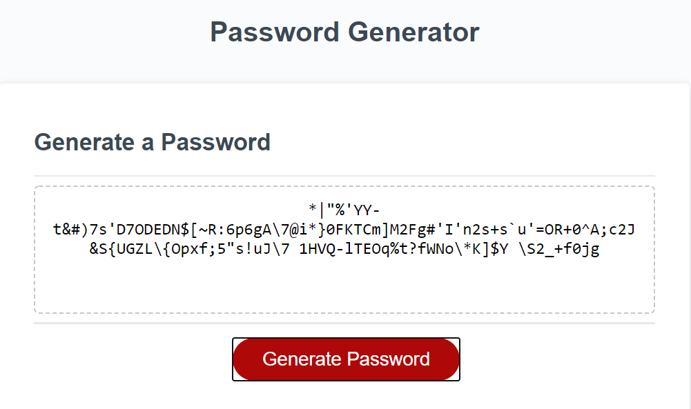

# Password Generator



## Description 

This app generates a password of any length ranging between 8 to 128 characters, inclusive. Invalid input lengths are rejected, with a repeat of the prompt to ask for a number in the accepted range. The user can choose which additional character types to include in th password generation, and the resulting password is displayed on-page.

This app showcases user interface incoporated through basic javascript. Multiple variable types are showcased (boolean, numbers, strings), as well as javascript loops ('while' and 'for'), array manipulation, and calling functions to return values.


### (code snippet showing part of a function and a 'while' loop)
```javascript

function generatePassword() {

  var pwd_lngth = parseInt(prompt("Please choose a password character length"));

  while (!(pwd_lngth >= 8 && pwd_lngth <= 128)) {


```

### one of the 'if' statements that allowed expansion of character types to use in the password generation
```javascript

if (do_num) {                                    //if numbers are allowed, add it to default reference list
    cat_list = cat_list + num;
    cat_length = cat_length + num.length;           //add length to default length (allows access via index to each entry in combined list)
    pwd.push(num[Math.floor(Math.random() * num.length)]);      // puts random number at first availability of list; ensures one of this char type in password
    xtra_lists++;
  }

```


### Links

[Deployed Website](https://guides.github.com/features/mastering-markdown/).
[GitHub Repository](https://github.com/microsoft/vscode).

